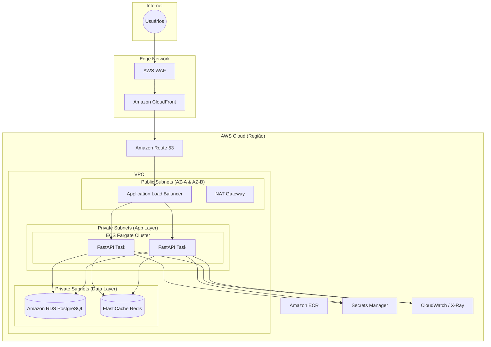

# Proposta de Upgrade: Arquitetura AWS Full Stack Production-Ready

Após analisar o projeto atual, proponho uma evolução da arquitetura para suportar cargas de trabalho de produção reais com maior segurança, persistência e performance.

## 1. Melhorias Propostas

### 🛡️ Segurança Avançada
- **AWS WAF**: Implementação de Web Application Firewall à frente do ALB para proteção contra SQL Injection, XSS e bots.
- **AWS Secrets Manager**: Migração das variáveis de ambiente sensíveis (como DB_PASSWORD) para o Secrets Manager com rotação automática.
- **KMS**: Criptografia de dados em repouso nos logs do CloudWatch e volumes EBS.

### 💾 Persistência e Dados
- **Amazon RDS (PostgreSQL)**: Substituição de mocks ou arquivos locais por um banco de dados relacional gerenciado, com Multi-AZ para alta disponibilidade.
- **Amazon S3**: Bucket para armazenamento de arquivos estáticos ou uploads de usuários.

### ⚡ Performance e Entrega
- **Amazon CloudFront**: CDN global para servir o frontend (React/Vite) e reduzir a latência.
- **AWS ElastiCache (Redis)**: Camada de cache para acelerar respostas de consultas frequentes.

### 📈 Observabilidade
- **AWS X-Ray**: Implementação de rastreamento distribuído (já presente na aplicação mas requer integração na infra).
- **Service Lens**: Visualização integrada de métricas e rastros.

---

## 2. Diagrama de Arquitetura Proposta (Mermaid)

---

## 3. Próximos Passos

1. **Atualizar Módulos Terraform**: Criar `modules/rds` e `modules/cloudfront`.
2. **Integração Secrets Manager**: Modificar o `app/main.py` para buscar credenciais via SDK.
3. **Documentação**: Atualizar o README com a nova visão de longo prazo.
